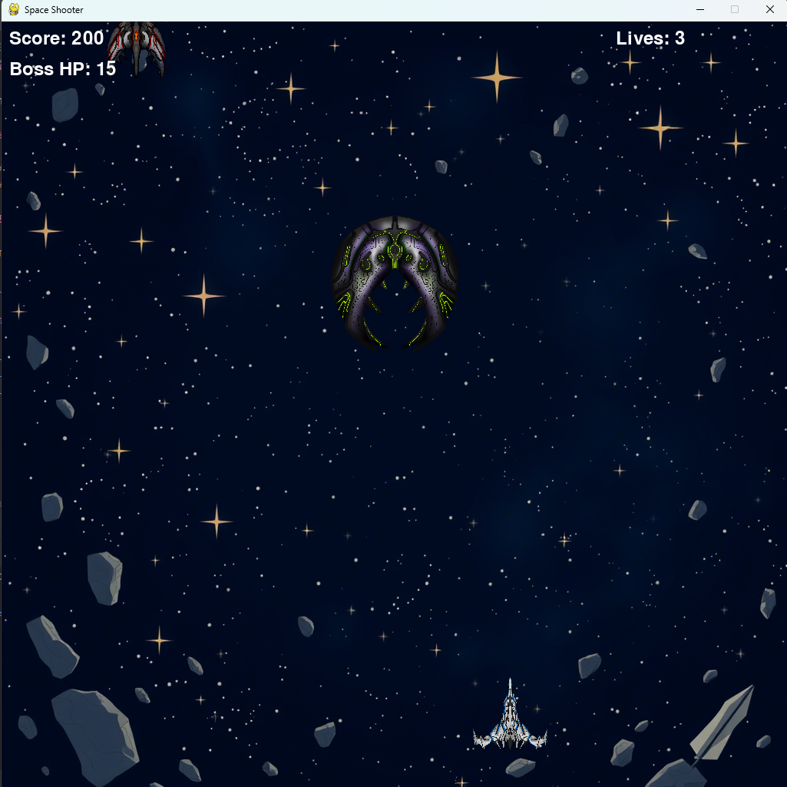
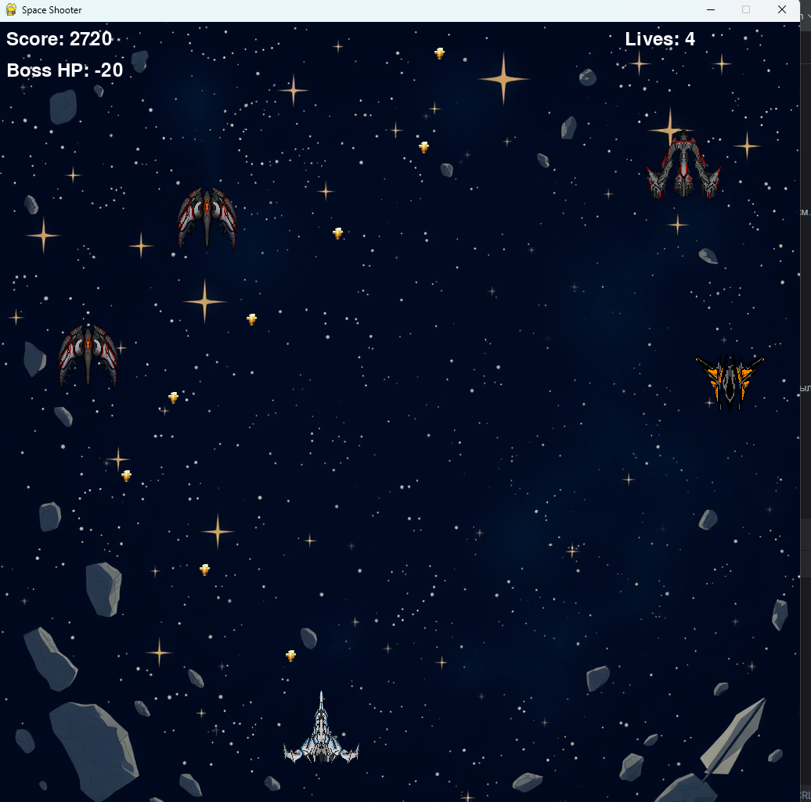

# StarsShooter_pygame
# Space Shooter

## Описание Проекта

"Space Shooter" — это космическая аркадная игра, где вы управляете космическим кораблем, стреляя в вражеские корабли, астероиды и боссов. Ваша цель — набрать как можно больше очков, уничтожая врагов и избегая столкновений с ними и их пулями.

## Структура Проекта
space_shooter/
│
├── main.py
├── player.py
├── enemy.py
├── bullet.py
├── powerup.py
├── boss.py
├── game.py
├── settings.py
├── utils.py
├── assets/
│ ├── player.png
│ ├── player_damaged.png
│ ├── enemy_weak.png
│ ├── enemy_medium.png
│ ├── enemy_strong.png
│ ├── enemy_asteroid.png
│ ├── boss.png
│ ├── bullet1.png
│ ├── bullet2.png
│ ├── powerup_damage.png
│ ├── powerup_speed.png
│ ├── powerup_life.png
│ ├── explosion_lg_1.png
│ ├── explosion_lg_2.png
│ ├── explosion_lg_3.png
│ ├── explosion_lg_4.png
│ ├── explosion_lg_5.png
│ ├── explosion_lg_6.png
│ ├── explosion_lg_7.png
│ ├── explosion_lg_8.png
│ ├── explosion_lg_9.png
│ ├── explosion_sm_1.png
│ ├── explosion_sm_2.png
│ ├── explosion_sm_3.png
│ ├── explosion_sm_4.png
│ ├── explosion_sm_5.png
│ ├── explosion_sm_6.png
│ ├── explosion_sm_7.png
│ ├── explosion_sm_8.png
│ ├── explosion_sm_9.png
│ ├── background.png
│ └── music/
│ ├── background_music.mp3
│ ├── shoot1.wav
│ └── game_over.wav
└── README.md


## Установка и Запуск

1. **Клонирование Репозитория**:
    ```bash
    git clone https://github.com/yourusername/space-shooter.git
    cd space-shooter
    ```

2. **Создание Виртуального Окружения**:
    ```bash
    python -m venv .venv
    source .venv/bin/activate  # Для Windows: .venv\Scripts\activate
    ```

3. **Установка Зависимостей**:
    Убедитесь, что у вас установлен Pygame. Если нет, установите его с помощью pip:
    ```bash
    pip install pygame
    ```

4. **Запуск Игры**:
    ```bash
    python main.py
    ```

## Управление Игрой

- **Перемещение Игрока**:
    - **Стрелка Влево**: Перемещает игрока влево.
    - **Стрелка Вправо**: Перемещает игрока вправо.

- **Стрельба**:
    - **Левая Кнопка Мыши**: Стреляет из оружия 1.
    - **Правая Кнопка Мыши**: Стреляет из оружия 2 (перезарядка каждые 10 секунд).

- **Пауза**:
    - **Esc**: Открывает экран паузы.

- **Отключение/Включение Звука**:
    - **M**: Включает или выключает звук.

## Функциональность Игры

- **Игрок**:
    - Имеет 3 жизни.
    - Может использовать два типа оружия: первое всегда доступно, второе перезаряжается каждые 10 секунд.
    - При столкновении с врагом или его пулями теряет жизнь.
    - После потери всех жизней игра заканчивается, и отображается экран "Game Over".

- **Враги**:
    - Три типа врагов: слабый, средний, сильный с разным уровнем HP.
    - Враги движутся сверху вниз по одной из вертикальных полос.
    - При столкновении с игроком или его пулями враги теряют HP.
    - После уничтожения всех врагов на уровне начинается новый уровень с увеличенным количеством врагов.
    - Каждый третий уровень появляется босс с HP, эквивалентным 20 обычным врагам. Босс стреляет в игрока.

- **Усиления**:
    - Рандомно появляются усиления, которые движутся сверху вниз.
    - При столкновении с усилением игрок получает бонус к урону на 30 секунд.
    - Усиления появляются через минуту после активации предыдущего.

- **Интерфейс**:
    - В правом верхнем углу отображается HP игрока.
    - Над боссом отображается его HP.
    - В левом верхнем углу отображается количество очков.
    - При потере всех HP игрок через 3 секунды снова появляется на карте и на счетчике жизней отображается количество жизней -1.
    - После потери 3 жизней на экране появляется надпись "Game Over" и количество набранных очков.

- **Графика**:
    - Все спрайты (игрок, враги, пули, усиления, фон) загружаются из PNG-файлов.
    - При столкновении с врагом спрайт игрока меняется на другой.

- **Архитектура**:
    - Код написан в соответствии с принципами ООП и SOLID.
    - Каждый класс вынесен в отдельный скрипт.
    - Используются абстрактные классы для общих функциональностей.

## Спрайты и Звуки

Убедитесь, что все необходимые спрайты и звуковые файлы находятся в папке `assets` и правильно именованы:

### Спрайты

- `player.png`: Спрайт игрока.
- `player_damaged.png`: Спрайт поврежденного игрока.
- `enemy_weak.png`: Спрайт слабого врага.
- `enemy_medium.png`: Спрайт среднего врага.
- `enemy_strong.png`: Спрайт сильного врага.
- `enemy_asteroid.png`: Спрайт астероида.
- `boss.png`: Спрайт босса.
- `bullet1.png`: Спрайт пули оружия 1.
- `bullet2.png`: Спрайт пули оружия 2.
- `powerup_damage.png`: Спрайт усиления урона.
- `powerup_speed.png`: Спрайт усиления скорости.
- `powerup_life.png`: Спрайт усиления жизней.
- `explosion_lg_1.png` до `explosion_lg_9.png`: Кадры анимации крупного взрыва.
- `explosion_sm_1.png` до `explosion_sm_9.png`: Кадры анимации малого взрыва.
- `background.png`: Фоновое изображение.

### Звуки

- `background_music.mp3`: Фоновая музыка.
- `shoot1.wav`: Звук выстрела из оружия 1.
- `game_over.wav`: Звук конца игры.

## Авторы

- **Ваше Имя**: Разработчик и автор проекта.

## Лицензия

Этот проект лицензирован под лицензией MIT. Подробнее см. файл [LICENSE](LICENSE).

## Контакты

- **Email**: ваш.email@example.com
- **GitHub**: [https://github.com/yourusername](https://github.com/yourusername)

## Запись Видео

Вы можете просмотреть видео с демонстрацией игры по ссылке ниже:

[Ссылка на видео демонстрацию](https://www.youtube.com/watch?v=your_video_id)

## Скриншоты





MIT License

Copyright (c) 2023 Ваше Имя

Permission is hereby granted, free of charge, to any person obtaining a copy
of this software and associated documentation files (the "Software"), to deal
in the Software without restriction, including without limitation the rights
to use, copy, modify, merge, publish, distribute, sublicense, and/or sell
copies of the Software, and to permit persons to whom the Software is
furnished to do so, subject to the following conditions:

The above copyright notice and this permission notice shall be included in all
copies or substantial portions of the Software.

THE SOFTWARE IS PROVIDED "AS IS", WITHOUT WARRANTY OF ANY KIND, EXPRESS OR
IMPLIED, INCLUDING BUT NOT LIMITED TO THE WARRANTIES OF MERCHANTABILITY,
FITNESS FOR A PARTICULAR PURPOSE AND NONINFRINGEMENT. IN NO EVENT SHALL THE
AUTHORS OR COPYRIGHT HOLDERS BE LIABLE FOR ANY CLAIM, DAMAGES OR OTHER
LIABILITY, WHETHER IN AN ACTION OF CONTRACT, TORT OR OTHERWISE, ARISING FROM,
OUT OF OR IN CONNECTION WITH THE SOFTWARE OR THE USE OR OTHER DEALINGS IN THE
SOFTWARE.

